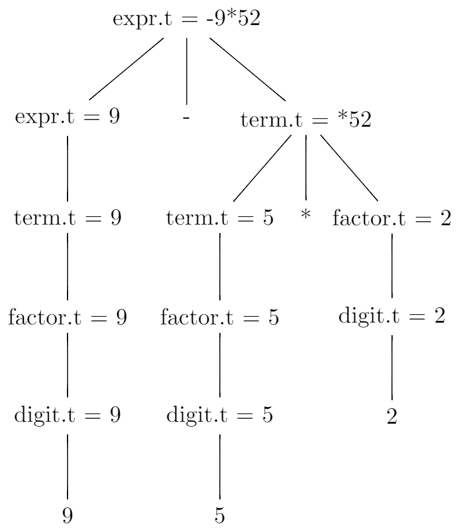
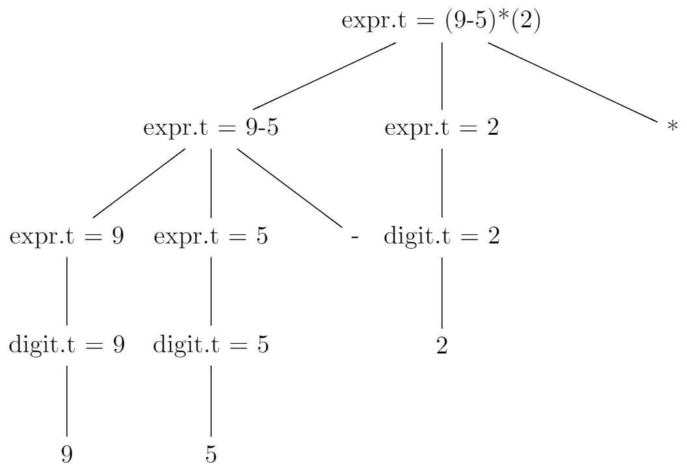
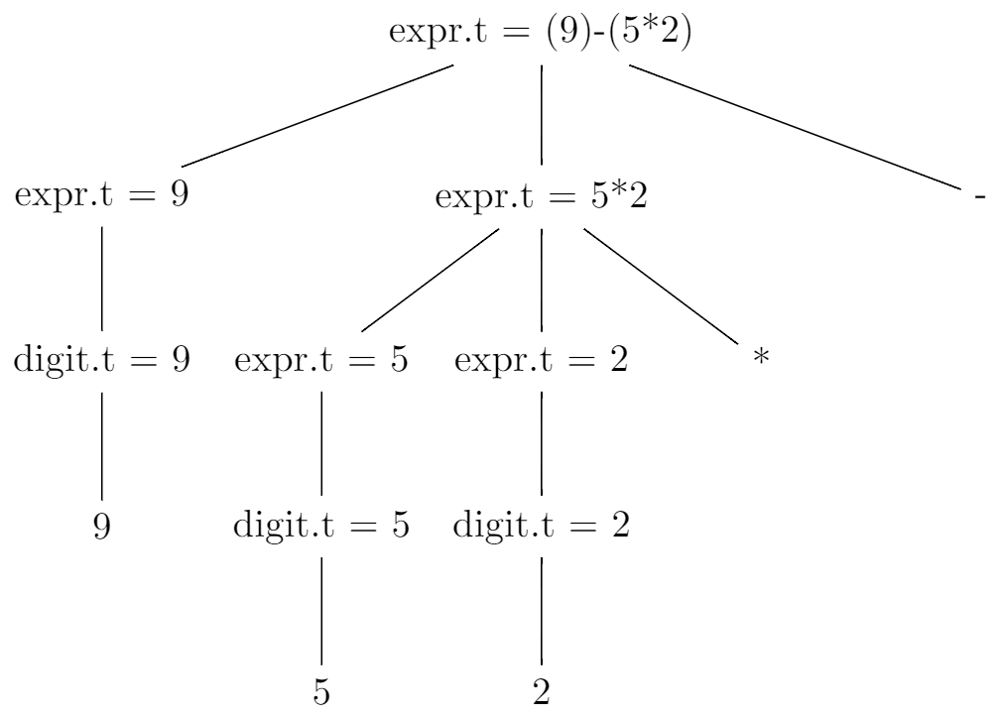

# 2.3 Syntax-Directed Translation
## 2.3.1
```
expr -> {print('+')} expr + term | {print('-')} expr - term | term
term -> {print('*')} term * factor | {print('/')} term / factor | factor
factor -> digit | (expr)
digit -> 0 {print('0')}
digit -> 1 {print('1')}
digit -> 2 {print('2')}
digit -> 3 {print('3')}
digit -> 4 {print('4')}
digit -> 5 {print('5')}
digit -> 6 {print('6')}
digit -> 7 {print('7')}
digit -> 8 {print('8')}
digit -> 9 {print('9')}
```

`9-5+2`:
```
\documentclass{standalone} 
\usepackage{tikz}

\begin{document}
\begin{tikzpicture}
\tikzstyle{level 1}=[sibling distance=18mm]
\tikzstyle{level 2}=[sibling distance=13mm]

\node (root){expr.t = +-952} 
    child {node {expr.t = -95}
        child {node {expr.t = 9}
            child {node {term.t = 9}
                child {node {factor.t = 9}
                    child {node {digit.t = 9}
                        child {node {9}}}}}}
        child {node {-}}
        child {node {term.t = 5}
            child {node {factor.t = 5}
                child {node {digit.t = 5}
                    child {node {5}}}}}}
    child {node {+}}
    child {node {term.t = 2}
        child {node {factor.t = 2}
            child {node {digit.t = 2}
                child {node {2}}}}};
\end{tikzpicture}
\end{document}
```


`9-5*2`:
```
\documentclass{standalone} 
\usepackage{tikz}

\begin{document}
\begin{tikzpicture}
\tikzstyle{level 1}=[sibling distance=18mm]
\tikzstyle{level 2}=[sibling distance=13mm]

\node (root){expr.t = -9*52} 
    child {node {expr.t = 9}
        child {node {term.t = 9}
            child {node {factor.t = 9}
                child {node {digit.t = 9}
                    child {node {9}}}}}}
    child {node {-}}
    child {node {term.t = *52}
        child {node {term.t = 5}
            child {node {factor.t = 5}
                child {node {digit.t = 5}
                    child {node {5}}}}}
        child {node {*}}
        child {node {factor.t = 2}
            child {node {digit.t = 2}
                child {node {2}}}}};
\end{tikzpicture}
\end{document}
```



## 2.3.2
```
expr -> expr {print('+')} expr +
expr -> expr {print('-')}  expr -
expr -> {print('(')} expr {print(')')} {print('*')}  {print('(')} expr {print(')')} *
expr -> {print('(')} expr {print(')')} {print('/')}  {print('(')} expr {print(')')} /
expr -> digit
digit -> 0 {print('0')}
digit -> 1 {print('1')}
digit -> 2 {print('2')}
digit -> 3 {print('3')}
digit -> 4 {print('4')}
digit -> 5 {print('5')}
digit -> 6 {print('6')}
digit -> 7 {print('7')}
digit -> 8 {print('8')}
digit -> 9 {print('9')}
```

`95-2*`:
```
\documentclass{standalone} 
\usepackage{tikz}

\begin{document}
\begin{tikzpicture}
\tikzstyle{level 1}=[sibling distance=32mm]
\tikzstyle{level 2}=[sibling distance=20mm]

\node (root){expr.t = (9-5)*(2)} 
    child {node {expr.t = 9-5}
        child {node {expr.t = 9}
            child {node {digit.t = 9}
                child {node {9}}}}
        child {node {expr.t = 5}
            child {node {digit.t = 5}
                child {node {5}}}}
        child {node {-}}}
    child {node {expr.t = 2}
        child {node {digit.t = 2}
            child {node {2}}}}
    child {node {*}};
\end{tikzpicture}
\end{document}
```



`952*-`:
```
\documentclass{standalone} 
\usepackage{tikz}

\begin{document}
\begin{tikzpicture}
\tikzstyle{level 1}=[sibling distance=40mm]
\tikzstyle{level 2}=[sibling distance=20mm]

\node (root){expr.t = (9)-(5*2)} 
    child {node {expr.t = 9}
        child {node {digit.t = 9}
            child {node {9}}}}
    child {node {expr.t = 5*2}
        child {node {expr.t = 5}
            child {node {digit.t = 5}
                child {node {5}}}}
        child {node {expr.t = 2}
            child {node {digit.t = 2}
                child {node {2}}}}
        child {node {*}}}
    child {node {-}};
\end{tikzpicture}
\end{document}
```



## 2.3.3
```
integer -> a b c d {print(a.roman || b.roman || c.roman || d.roman)}
a -> lessThanFour {a.roman = lessThanFour.int * 'M'}
b -> lessThanFour {b.roman = lessThanFour.int * 'C'}
b -> four {b.roman = 'CD'}
b -> lessThanNine {b.roman = 'D' || (lessThanNine.int - 5) * 'C'}
b -> nine {b.roman = 'CM'}
c -> lessThanFour {c.roman = lessThanFour * 'X'}
c -> four {c.roman = 'XL'}
c -> lessThanNine {c.roman = 'L' || (lessThanNine.int - 5) * 'X'}
c -> nine {c.roman = 'XC'}
d -> lessThanFour {d.roman = lessThanFour.int * 'I'}
d -> four {d.roman = 'IV'}
d -> lessThanNine {d.roman = 'V' || (lessThanNine.int - 5) * 'I'}
d -> nine {d.roman = 'IX'}
lessThanFour -> 0 | 1 | 2 | 3
four -> 4
lessThanNine -> 5 | 6 | 7 | 8
nine -> 9
```

## 2.3.4
```
romanNumeral -> a b c d {print(a.int * 1000 + b.int * 100 + c.int * 10 + d.int)}
a -> M* {a.int = count('M')}
b -> CD {b.int = 4}
b -> CM {b.int = 9}
b -> D{0,1}C{0,3} {b.int = count('D') * 5 + count('C')}
b -> ε {b.int = 0}
c -> XL {c.int = 4}
c -> XC {c.int = 9}
c -> L{0,1}X{0,3} {c.int = count('L') * 5 + count('X')}
c -> ε {c.int = 0}
d -> IV {d.int = 4}
d -> IX {d.int = 9}
d -> V{0,1}I{0,3} {d.int = count('V') * 5 + count('I')}
d -> ε {d.int = 0}
```

## 2.3.5
```
expr -> {print('+')} expr expr +
expr -> {print('-')} expr expr -
expr -> {print('*')} expr expr *
expr -> {print('/')} expr expr /
expr -> digit | (expr)
digit -> 0 {print('0')}
digit -> 1 {print('1')}
digit -> 2 {print('2')}
digit -> 3 {print('3')}
digit -> 4 {print('4')}
digit -> 5 {print('5')}
digit -> 6 {print('6')}
digit -> 7 {print('7')}
digit -> 8 {print('8')}
digit -> 9 {print('9')}
```