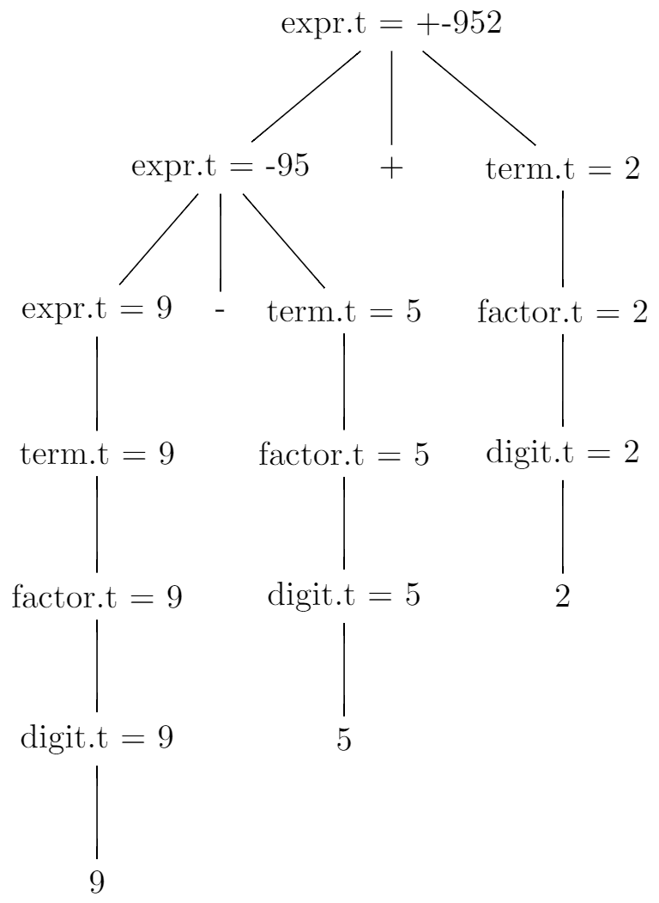

# 2.3 Syntax-Directed Translation
## 2.3.1
```
expr -> {print('+')} expr + term | {print('-')} expr - term | term
term -> {print('*')} term * factor | {print('/')} term / factor | factor
factor -> digit | (expr)
digit -> 0 {print('0')}
digit -> 1 {print('1')}
digit -> 2 {print('2')}
digit -> 3 {print('3')}
digit -> 4 {print('4')}
digit -> 5 {print('5')}
digit -> 6 {print('6')}
digit -> 7 {print('7')}
digit -> 8 {print('8')}
digit -> 9 {print('9')}
```

`9-5+2`:
```
\documentclass{standalone} 
\usepackage{tikz}

\begin{document}
\begin{tikzpicture}
\tikzstyle{level 1}=[sibling distance=18mm]
\tikzstyle{level 2}=[sibling distance=13mm]

\node (root){expr.t = +-952} 
    child {node {expr.t = -95}
        child {node {expr.t = 9}
            child {node {term.t = 9}
                child {node {factor.t = 9}
                    child {node {digit.t = 9}
                        child {node {9}}}}}}
        child {node {-}}
        child {node {term.t = 5}
            child {node {factor.t = 5}
                child {node {digit.t = 5}
                    child {node {5}}}}}}
    child {node {+}}
    child {node {term.t = 2}
        child {node {factor.t = 2}
            child {node {digit.t = 2}
                child {node {2}}}}};
\end{tikzpicture}
\end{document}
```



`9-5*2`:
```
\documentclass{standalone} 
\usepackage{tikz}

\begin{document}
\begin{tikzpicture}
\tikzstyle{level 1}=[sibling distance=18mm]
\tikzstyle{level 2}=[sibling distance=13mm]

\node (root){expr.t = -9*52} 
    child {node {expr.t = 9}
        child {node {term.t = 9}
            child {node {factor.t = 9}
                child {node {digit.t = 9}
                    child {node {9}}}}}}
    child {node {-}}
    child {node {term.t = *52}
        child {node {term.t = 5}
            child {node {factor.t = 5}
                child {node {digit.t = 5}
                    child {node {5}}}}}
        child {node {*}}
        child {node {factor.t = 2}
            child {node {digit.t = 2}
                child {node {2}}}}};
\end{tikzpicture}
\end{document}
```


## 2.3.2
```
expr -> expr {print('+')} expr +
expr -> expr {print('-')}  expr -
expr -> {print('(')} expr {print(')')} {print('*')}  {print('(')} expr {print(')')} *
expr -> {print('(')} expr {print(')')} {print('/')}  {print('(')} expr {print(')')} /
expr -> digit
digit -> 0 {print('0')}
digit -> 1 {print('1')}
digit -> 2 {print('2')}
digit -> 3 {print('3')}
digit -> 4 {print('4')}
digit -> 5 {print('5')}
digit -> 6 {print('6')}
digit -> 7 {print('7')}
digit -> 8 {print('8')}
digit -> 9 {print('9')}
```

`95-2*`:
```
\documentclass{standalone} 
\usepackage{tikz}

\begin{document}
\begin{tikzpicture}
\tikzstyle{level 1}=[sibling distance=32mm]
\tikzstyle{level 2}=[sibling distance=20mm]

\node (root){expr.t = (9-5)*(2)} 
    child {node {expr.t = 9-5}
        child {node {expr.t = 9}
            child {node {digit.t = 9}
                child {node {9}}}}
        child {node {expr.t = 5}
            child {node {digit.t = 5}
                child {node {5}}}}
        child {node {-}}}
    child {node {expr.t = 2}
        child {node {digit.t = 2}
            child {node {2}}}}
    child {node {*}};
\end{tikzpicture}
\end{document}
```


`952*-`:
```
\documentclass{standalone} 
\usepackage{tikz}

\begin{document}
\begin{tikzpicture}
\tikzstyle{level 1}=[sibling distance=40mm]
\tikzstyle{level 2}=[sibling distance=20mm]

\node (root){expr.t = (9)-(5*2)} 
    child {node {expr.t = 9}
        child {node {digit.t = 9}
            child {node {9}}}}
    child {node {expr.t = 5*2}
        child {node {expr.t = 5}
            child {node {digit.t = 5}
                child {node {5}}}}
        child {node {expr.t = 2}
            child {node {digit.t = 2}
                child {node {2}}}}
        child {node {*}}}
    child {node {-}};
\end{tikzpicture}
\end{document}
```


## 2.3.3
